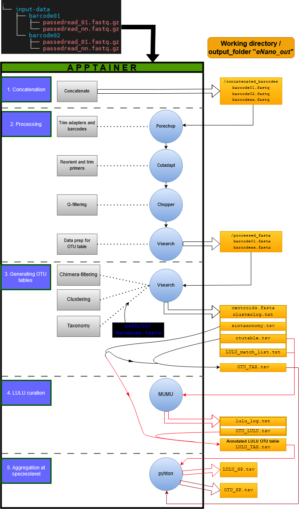

A simple, containerized workflow for eDNA runs on basecalled, demultiplexed Nanopore data as outputted by MinKnow.  
---
This pipeline was published as part of [What Quality Suffices for Nanopore Metabarcoding? Reconsidering Methodology and Ectomycorrhizae in Decaying Fagus sylvatica Bark as Case Study](https://doi.org/10.3390/jof10100708)

## Introduction
eNano is a pipeline that generates an OTU (Operational Taxonomic Unit) table and associated taxonomy from demultiplexed Nanopore data outputted by Minknow.  
The input is usually a 'fastq_pass' directory with barcode01 - barcode96 subdirectories, each containing fastq files that passed some user-defined quality threshold.

This branch of the pipeline runs in a containerized environment for ease of use (using Apptainer/Singularity)

The pipeline consists of five consecutive steps:  

1. **Concatenation**: Concatenate fastq.gz files in each barcode subdirectory into a single fastq. The results are outputted in `concatenated_barcodes`.  

2. **Processing**: This step involves processing each barcode fastq file, with output in `processed_fasta`. The steps include:  
   - Porechop trimming  
   - Cutadapt reorientation using forward primer and --rc flag  
   - Cutadapt trim of primers, only sequences with both forward and reverse primers are retained  
   - Chopper quality filter at user-defined phred score  
   - Vsearch conversion to fasta  
   - Sed on sequence IDs prepends barcode name and removes whitespaces  
   - Vsearch appends sample names for parsing OTU table  

3. **Generation of OTU table**: This step uses output from step 2 to generate a single OTU table and taxonomy. The results are outputted in the main folder. The steps include:  
   - Concatenate processed fasta files  
   - Sed on sequence IDs to append semicolon (temporary fix for parsing)  
   - Vsearch OTU cluster and relabel sequences  
   - Vsearch sorts OTUs by size  
   - Vsearch chimera filtering with uchime_denovo or uchime_ref
   - Vsearch retrieve taxonomy with sintax from database fasta file  
   - Join OTU table with taxonomy table  
   - Vsearch creates a match_list which can be used in LULU for curating OTU table  

4. **lulu curation of OTU table**: This step uses output from step 3 to curate the OTU table running the lulu algorithm as implemented in mumu. The results are outputted in the main folder. The steps include:  
   - runs mumu using otu-table and match list
   - join curated otu-table with taxonomy table  
              
5. **aggregation at species-level** uses OTU table from step 3 and if present LULU table from step 4 to aggregate OTUs at species-level - outputted in the main folder.
    - runs python
        + takes OTU_TAX table and if present OTU_LULU table
        + filters on sintax confindence and abundance
          ° singletons need 0.95 confidence for retention
          ° multitons need 0.80 confidence for retention
      + aggregate species-level names of retained OTUs  

### Workflow  
  

---
## Installation  

Having Apptainer (previously Singularity) is a **prerequisite** for running this branch of eNano!

Download the definition file [eNano_definition](./build/eNano_definition)
Run the build command pointing to the eNano_definition location
```shell
apptainer build eNano.sif eNano_definition
```
For troubles with priveliges see a potential solution at [workaround](./build/build_permission_workaround.txt)

In the working directory, a new file eNano.sif should be present
It is good practice to move this file (the container) from the install to a new, more long-term location.
```shell
mv eNano.sif /path/to/long_term_location/eNano.sif
```  
run using conatiner with desired flags as described in the documentation
```shell
apptainer run eNano.sif --help
```  

```bash
$ eNano --help 
  
eNano: Pipeline that generates an OTU table and associated taxonomy from demultiplexed Nanopore data outputted by Minknow.  
          The input usually is a 'fastq_pass' directory with barcode01 - barcode96 subdirectories, each containing fastq files that passed some user-defined quality threshold.  
          3 steps are performed, each of which can be skipped.  
            1) concatenate fastq.gz files in each barcode subdirectory into a single fastq - outputted in concatenated_barcodes.  
            2) processing each barcode fastq file - outputted in processed_fasta.  
               - porechop trim  
               - cutadapt reorient using forward primer and --rc flag  
               - cutadapt trim of primers, only sequences with both forward and reverse primers are retained  
               - NanoFilt quality filter at user-defined phred score  
               - vsearch convert to fasta  
               - sed on sequence IDs prepends barcode name and removes whitespaces  
               - vsearch appends sample names for parsing OTU table  
            3) uses output from step 2 to generate a single OTU table and taxonomy - outputted in main folder  
               - concatenate processed fasta files  
               - sed on sequence IDs to append semicolon (temporary fix for parsing)  
               - vsearch OTU cluster and relabel sequences  
               - vsearch sorts OTUs by size  
               - vsearch chimera filtering with uchime_denovo or uchime_ref
               - vsearch retrieve taxonomy with sintax from database fasta file  
               - vsearch creates a match_list which can be used in LULU for curating OTU table  
            4) uses match_list from step 3 to perform lulu curation of OTU table - outputted in the main folder.
               - runs mumu using otu-table and match list
               - join curated otu-table with taxonomy table  
            5) uses OTU table from 3 and/or LULU-curated table from step 4 to construct a table aggregated at the species-level - outputted in the main folder.
               - runs python
                 + takes OTU_TAX table and if present OTU_LULU table
                 + filters on sintax confindence and abundance
                     ° singletons need 0.95 confidence for retention
                     ° multitons need 0.80 confidence for retention
                 + aggregate species-level names of retained OTUs

Usage: apptainer run eNano.sif [[--help] (--fastqgz dir --output dir --threads value)  
                             (--fwp string --rvp string --minlength value --maxlength value)  
                             (--ee value --q value --maxqual value --clusterid value --db file --chimref [arg])  
                             (--mintax value--skip-concat [arg] --skip-process [arg] --skip-otu [arg])
                             (--skip-lulu [arg] --skip-sp [arg]) 
Options:  
  -h, --help           Display this help message  
  --fastqgz PATH       Path to the directory with fastq.gz files (required, unless --skip-concat 1)  
  --output name        Foldername for the output directory (default: eNano_out)  
  --threads NUM        Number of threads to use (default: 1)  
  --fwp SEQUENCE       Forward primer sequence for cutadapt (default=ITS1F: CTTGGTCATTTAGAGGAAGTAA)  
  --rvp SEQUENCE       Reverse primer sequence for cutadapt (default=ITS4: GCATATCAATAAGCGGAGGA)  
  --minlength NUM      Minimum length of reads to keep in cutadapt(default: 400)  
  --maxlength NUM      Maximum length of reads to keep in cutadapt(default: 1200)  
  --ee NUM             Expected error rate for cutadapt (default: 0.2)  
  --q NUM              Quality threshold for chopper (default: 25)
  --maxqual NUM        Maximum Quality threshold for chopper (default: 1000)
  --clusterid NUM      OTU clustering identity threshold in vsearch (default: 0.98)
  --mintax NUM         cut-off for SINTAX confidence in taxonomy splitting
  --db FASTAFILE       Path to the reference FASTA file for taxonomy assignment in vsearch (required, unless --skip-otu 1)  
  --chimref            De-novo chimera filtering if set to 1 (default: 0, reference-based using --db)
  --skip-concat        Skip the concatenation step if set to 1 (default: 0)  
  --skip-process       Skip the processing step if set to 1 (default: 0)  
  --skip-otu           Skip the OTU clustering and taxonomy assignment step if set to 1 (default: 0)  
  --skip-lulu          Performs the LULU otu curation step if set to 0 (default: 1)
  --skip-sp            Aggregates otus at the Species-level step if set to 0 (default: 1)
```
  

---
## Test data
Test data can be found under `fastq_test`. This is part of the data generated for our paper [REF].  
To generate an OTU-table and taxonomic assignment (if not include --skip-otu 1), download a reference database that works with the vsearch --sintax flag (e.g., the UNITE db for fungi - USEARCH/UTAX release [here](https://unite.ut.ee/repository.php)).
Version 10 for fungi can be found in this repository as `unite_sintax.fasta`. This file has the species-level names switched out for the SH code. If using this file, unzip first using
```shell
gunzip path/to/test_data/unite_sintax.fasta.gz
```
Run test data it with the following command (should take  <10 minutes):  
```shell
 apptainer run eNano.sif --fastqgz path/to/test_data/fastq_test --output testrun_eNano --threads 8 --db path/to/test_data/unite_sintax.fasta --skip-lulu 0 --skip-sp 0
```  
(more threads can be set, but multiple (sub)steps can only use 1 thread - no great improvements in run time should be expected for this small dataset)  
  
**expected output** (see test_data/default_testrun_eNano.tar.gz)
The output should all be contained in a folder `testrun_eNano` in the working directory:  
- `concatenated_barcodes`
  folder contains a single fastq file per barcode.  
- `processed_fasta`
  folder contains a fasta file per processed barcode - each `barcodeXX.fastq` file was passed to porechop -> cutadapt -> chopper -> vsearch.
- `barcodes.fasta`
  file holds all the processed_fasta fasta files (with barcode information contained in the sequence headers)  
- `centroids.fasta`
  file holds the chimera-filtered OTUs, clustered at (default) 98% identity.
- `clusterlog.txt`
  logfile from the clustering process.
- `testrun_eNano_otutable.tsv`
  file contains the tab-delimited raw OTU table.
- `testrun_eNano_sintaxonomy.tsv`
  file contains the tab-delimited taxonomic assignment per OTU.  
- `testrun_eNano_LULU_match_list.txt`
  file contains  information that can be passed to the LULU algorithm for post-clustering curation of the OTU table. Check out the [LULU repository](https://github.com/tobiasgf/lulu) and the [MUMU repository](https://github.com/frederic-mahe/mumu) for more information. 
- `testrun_eNano_OTU_TAX.tsv`
  file contains the ***main output*** and is the same OTU table as `testrun_eNano_otutable.tsv`, but has the taxonomic ids from `testrun_eNano_sintaxonomy.tsv` appended.
  
The following files will also be outputted if Step 4 - lulu-curation is enabled (--skip-lulu 0) 
- `testrun_eNano_OTU_LULU.tsv`
  file contains the lulu-curated OTU-table.
- `testrun_eNano_OTU_TAX_LULU.tsv`
  file contains the same OTU table as `testrun_eNano_OTU_LULU.tsv`, but has taxonomic ids from `testrun_eNano_sintaxonomy.tsv` appended.  
- `testrun_eNano_lulu_log.txt`
  logfile from lulu-curation.

The following files will also be outputted if Step 5 - species aggregation is enabled (--skip-sp 0) 
- `testrun_eNano_OTU_SP.tsv`
  file aggregates the OTU-level abundances in `testrun_eNano_OTU_TAX.tsv` to species-level abundances using 0.95 SINTAX confidence for singleton OTUs and 0.8 SINTAX confidence for multiton OTUs.
- `testrun_eNano_LULU_SP.tsv`
  file aggregates the OTU-level abundances in `testrun_eNano_OTU_TAX_LULU.tsv` to species-level abundances using 0.95 SINTAX confidence for singleton OTUs and 0.8 SINTAX confidence for multiton OTUs. 
  
`clusterlog.txt` should display this info:  
[...]  
950503 nt in 1481 seqs, min 472, max 751, avg 642
[...]  
Clusters: 13 Size min 1, max 1465, avg 113.9
Singletons: 11, 0.7% of seqs, 84.6% of clusters
  
  
The contents of `testrun_eNano_OTU_TAX.tsv` should resemble:  
""""""""""""""""""""""""""""""""""""""""""""""""""""""""""""""""""""""""""""""""""""""""""""""""""""""""""""""""""""""""""""""""""""""""  
| #OTU ID | barcode01 | barcode02 | barcode30 | SINTAX | TAX | domain | phylum | class | order | family | genus | species |
|---------|-----------|-----------|-----------|--------|-----|--------|--------|-------|-------|--------|-------|---------|
| OTU_1   | 555       | 910       | 0         | d:Fungi(1.00),p:Ascomycota(1.00)... | d:Fungi,p:Ascomycota,c:Sordariomycetes,o:Xylariales,f:Xylariaceae,g:Kretzschmaria | Fungi   | Ascomycota | Sordariomycetes | Xylariales  | Xylariaceae | Kretzschmaria |         |
| OTU_10  | 1         | 0         | 0         | d:Fungi(1.00),p:Ascomycota(0.99)... | d:Fungi,p:Ascomycota,c:Saccharomycetes,o:Saccharomycetales,f:Debaryomycetaceae | Fungi   | Ascomycota | Saccharomycetes | Saccharomycetales | Debaryomycetaceae |               |
| OTU_11  | 1         | 0         | 0         | d:Fungi(1.00),p:Basidiomycota(1.00)... | d:Fungi,p:Basidiomycota,c:Tremellomycetes,o:Filobasidiales,f:Piskurozymaceae,g:Solicoccozyma,s:SH0953900.10FU | Fungi   | Basidiomycota | Tremellomycetes | Filobasidiales | Piskurozymaceae | Solicoccozyma | SH0953900.10FU |
| OTU_12  | 1         | 0         | 0         | d:Fungi(1.00),p:Ascomycota(0.99)... | d:Fungi,p:Ascomycota,c:Leotiomycetes,o:Helotiales,f:Leptodontidiaceae,g:Leptodontidium | Fungi   | Ascomycota | Leotiomycetes  | Helotiales    | Leptodontidiaceae | Leptodontidium |               |
| OTU_13  | 1         | 0         | 0         | d:Fungi(1.00),p:Basidiomycota(1.00)... | d:Fungi,p:Basidiomycota,c:Agaricomycetes,o:Auriculariales | Fungi   | Basidiomycota | Agaricomycetes  | Auriculariales |               |               |               |
...

""""""""""""""""""""""""""""""""""""""""""""""""""""""""""""""""""""""""""""""""""""""""""""""""""""""""""""""""""""""""""""""""""""""""  
In barcode01 and barcode02, Kretzschmaria deusta is the top hit - a very common wood decay fungus in Beech. Indeed these barcodes correspond to samples taken from Beech dead wood.  
If sorted for abundance, Malassezia species are also top hits for this run, they are ubiquitous lab (human skin) yeasts.  
