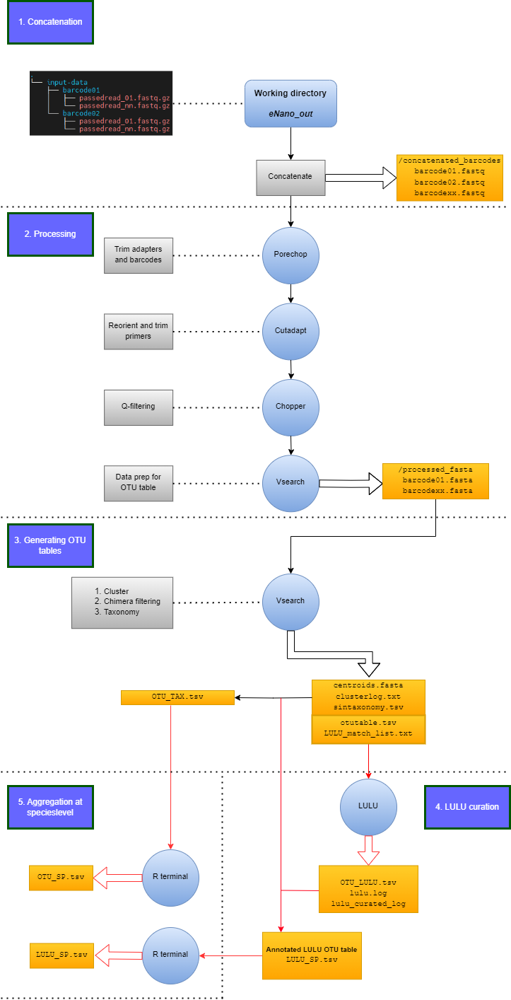

A simple workflow for eDNA runs on basecalled, demultiplexed Nanopore data as outputted by MinKnow.  
---

## Introduction
eNano is a pipeline that generates an OTU (Operational Taxonomic Unit) table and associated taxonomy from demultiplexed Nanopore data outputted by Minknow.  
The input is usually a 'fastq_pass' directory with barcode01 - barcode96 subdirectories, each containing fastq files that passed some user-defined quality threshold.  
The pipeline consists of four consecutive steps:  

1. **Concatenation**: Concatenate fastq.gz files in each barcode subdirectory into a single fastq. The results are outputted in `concatenated_barcodes`.  

2. **Processing**: This step involves processing each barcode fastq file, with output in `processed_fasta`. The steps include:  
   - Porechop trimming  
   - Cutadapt reorientation using forward primer and --rc flag  
   - Cutadapt trim of primers, only sequences with both forward and reverse primers are retained  
   - Chopper quality filter at user-defined phred score  
   - Vsearch conversion to fasta  
   - Sed on sequence IDs prepends barcode name and removes whitespaces  
   - Vsearch appends sample names for parsing OTU table  

3. **Generation of OTU table**: This step uses output from step 2 to generate a single OTU table and taxonomy. The results are outputted in the main folder. The steps include:  
   - Concatenate processed fasta files  
   - Sed on sequence IDs to append semicolon (temporary fix for parsing)  
   - Vsearch OTU cluster and relabel sequences  
   - Vsearch sorts OTUs by size  
   - Vsearch chimera filtering with uchime_denovo or uchime_ref
   - Vsearch retrieve taxonomy with sintax from database fasta file  
   - Join OTU table with taxonomy table  
   - Vsearch creates a match_list which can be used in LULU for curating OTU table  

4. **lulu curation of OTU table**: This step uses output from step 3 to curate the OTU table by implementing the lulu algorithm. The results are outputted in the main folder. The steps include:  
   !!This step is skipped by default as several errors easily pop-up depending on the system and R install  
   !!The script as is should be able to run on WSL2  
   !!If errors can not be resolved, Check out the [LULU repository](https://github.com/tobiasgf/lulu) and run seperately in R using match_list from step 3.  
   - Run R from  terminal 
      + Get output directory, load otu-table and match list  
      + Load lulu and dplyr (and install if required via devtools)  
      + Run lulu and output curated table  
      + Write the number of curated OTUs to log file  
   - Join curated otu-table with taxonomy table
     
5) **aggregation at species-level** uses OTU table from steps 3 and 4 to aggregate OTUs at species-level - outputted in the main folder.
    - runs R from terminal
      + get output directory, load otu-table and match list  
        + load stringr and dplyr 
        + load and run SH_table function to agrgegate OTUs at Species level
### Workflow  
  

---
## Installation  

Clone the github repo
```shell
git clone -b conda-yml-install https://github.com/MycoMatics/eNano.git
```  

```$ cd /path/to/eNano_directory```  
```$ ./eNano --install-conda ```  

If this is not working, try changing file permissions to make it executable and run the first command again:  
```$ chmod +x eNano```  

To activate the conda environment, run:  
```$ source activate```  
```$ conda activate eNano_env```  

To run eNano and display usage, run:  
```$ eNano --help```  
Or  
```bash
$ eNano -h  
  
./eNano --install-conda       installs eNano in the eNano_env conda environment and adds it to /envs/eNano_env/bin/ (only needed for initial install)  
eNano: Pipeline that generates an OTU table and associated taxonomy from demultiplexed Nanopore data outputted by Minknow.  
          The input usually is a 'fastq_pass' directory with barcode01 - barcode96 subdirectories, each containing fastq files that passed some user-defined quality threshold.  
          3 steps are performed, each of which can be skipped.  
            1) concatenate fastq.gz files in each barcode subdirectory into a single fastq - outputted in concatenated_barcodes.  
            2) processing each barcode fastq file - outputted in processed_fasta.  
               - porechop trim  
               - cutadapt reorient using forward primer and --rc flag  
               - cutadapt trim of primers, only sequences with both forward and reverse primers are retained  
               - NanoFilt quality filter at user-defined phred score  
               - vsearch convert to fasta  
               - sed on sequence IDs prepends barcode name and removes whitespaces  
               - vsearch appends sample names for parsing OTU table  
            3) uses output from step 2 to generate a single OTU table and taxonomy - outputted in main folder  
               - concatenate processed fasta files  
               - sed on sequence IDs to append semicolon (temporary fix for parsing)  
               - vsearch OTU cluster and relabel sequences  
               - vsearch sorts OTUs by size  
               - vsearch chimera filtering with uchime_denovo or uchime_ref
               - vsearch retrieve taxonomy with sintax from database fasta file  
               - vsearch creates a match_list which can be used in LULU for curating OTU table  
            4) takes match_list from step 3 to perform lulu curation of OTU table - outputted in the main folder  
               - runs R from terminal  
                 + get output directory, load otu-table and match list  
                 + load lulu and dplyr (and install if required via devtools)  
                 + run lulu and output curated table  
                 + write the number of curated OTUs to log file  
               - join curated otu-table with taxonomy table
            5) uses OTU table from steps 3 and 4 to aggregate OTUs at species-level - outputted in the main folder.
               - runs R from terminal
                 + get output directory, load otu-table and match list  
                 + load stringr and dplyr 
                 + load and run SH_table function to agrgegate OTUs at SH level

Usage: ./eNano [[--help] (--fastqgz dir --output dir --threads value)  
                             (--fwp string --rvp string --minlength value --maxlength value)  
                             (--ee value --q value --clusterid value --db file --chimref [arg])  
                             (--skip-concat [arg] --skip-process [arg] --skip-otu [arg])
                             (--skip-lulu [arg] --skip-sh [arg])" 
Options:  
  -h, --help           Display this help message  
  --fastqgz PATH       Path to the directory with fastq.gz files (required, unless --skip-concat 1)  
  --output name        Foldername for the output directory (default: eNano_out)  
  --threads NUM        Number of threads to use (default: 1)  
  --fwp SEQUENCE       Forward primer sequence for cutadapt (default=ITS1F: CTTGGTCATTTAGAGGAAGTAA)  
  --rvp SEQUENCE       Reverse primer sequence for cutadapt (default=ITS4: GCATATCAATAAGCGGAGGA)  
  --minlength NUM      Minimum length of reads to keep in cutadapt(default: 400)  
  --maxlength NUM      Maximum length of reads to keep in cutadapt(default: 1200)  
  --ee NUM             Expected error rate for cutadapt (default: 0.2)  
  --q NUM              Quality threshold for NanoFilt (default: 20)  
  --clusterid NUM      OTU clustering identity threshold in vsearch (default: 0.97)  
  --db FASTAFILE       Path to the reference FASTA file for taxonomy assignment in vsearch (required, unless --skip-otu 1)  
  --chimref            Reference-based (using --db) chimera filtering if set to 1 (default: 0)"  
  --skip-concat        Skip the concatenation step if set to 1 (default: 0)  
  --skip-process       Skip the processing step if set to 1 (default: 0)  
  --skip-otu           Skip the OTU clustering and taxonomy assignment step if set to 1 (default: 0)  
  --skip-lulu          Performs the LULU otu curation step if set to 0 (default: 1)
  --skip-sp            Aggregates otus at the Species-level step if set to 0 (default: 1)
  --install-conda      Installs eNano and adds it to /envs/eNano_env/bin/  
```
  

---
## Test data
Test data can be found under `fastq_test`. This is part of the data generated for our paper [REF].  
To generate an OTU-table and taxonomic assignment (if not include --skip-otu 1), download a reference database that works with the vsearch --sintax flag (e.g., the UNITE db for fungi - USEARCH/UTAX release [here](https://unite.ut.ee/repository.php)). Version 9.0 (2023-07-18) for fungi can be found in this repository as `unite_sintax.fasta`.  
..
Run test data it with the following command (should take  <10 minutes):  
```$ eNano --fastqgz /path/to/fastq_test --output testrun_eNano --threads 8 --db unite_sintax.fasta```  
(more threads can be set, but many (sub)steps can only use 1 thread - no great improvements in running time should be expected)  
  
**expected output**
The output should all be contained in a folder `testrun_eNano` in the working directory:  
- concatenated_barcodes  
- processed_fasta  
- barcodes.fasta  
- centroids.fasta  
- clusterlog.txt  
- testrun_eNano_otutable.tsv  
- testrun_eNano_sintaxonomy.tsv  
- testrun_eNano_LULU_match_list.txt  
- testrun_eNano_OTU_TAX.tsv  
  
The following files will also be outputted if Step 4 - lulu-curation is enabled (--skip-lulu 0) and runs without errors  
- testrun_eNano_OTU_LULU.tsv  
- testrun_eNano_OTU_TAX_LULU.tsv  
- testrun_eNano_lulu_curated_log.txt  
- lulu.log_$date_$time  


The `concatenated_barcodes` folder contains a single fastq file per barcode  
The `processed_fasta` folder contains a fasta file per processed barcode - each `barcodeXX.fastq` file was passed to porechop -> cutadapt -> NanoFilt -> vsearch.  
The `barcodes.fasta` file holds all the processed_fasta fasta files (with barcode information contained in the sequence headers)  
The `centroids.fasta` file holds the chimera-filtered OTUs, clustered at (default) 97% identity. The `clusterlog.txt` is the logfile from the clustering process.  
The `testrun_eNano_otutable.tsv` file contains the tab-delimited raw OTU table  
The `testrun_eNano_sintaxonomy.tsv` file contains the tab-delimited taxonomic assignment per OTU  
The `testrun_eNano_LULU_match_list.txt` file contains  information that can be passed to the LULU algorithm for post-clustering curation of the OTU table. Check out the [LULU repository](https://github.com/tobiasgf/lulu) for more information.  
The ***`testrun_eNano_OTU_TAX.tsv`*** file contains the ***main output*** and is the same OTU table as `testrun_eNano_otutable.tsv`, but has the taxonomic ids from `testrun_eNano_sintaxonomy.tsv` appended.  
  
The `testrun_eNano_OTU_LULU.tsv` file contains the lulu-curated OTU-table  
The `testrun_eNano_OTU_TAX_LULU.tsv` file contains the same OTU table as `testrun_eNano_OTU_LULU.tsv`, but has taxonomic ids from `testrun_eNano_sintaxonomy.tsv` appended.  
The `testrun_eNano_lulu_curated_log.txt` is a log file that specifies the amount of otus retained and discarded after lulu-curation  
The `lulu.log_$date_$time` file is the default lulu log file
  
  
  
`clusterlog.txt` should display this info:  
[...]  
4698547 nt in 7292 seqs, min 426, max 875, avg 644  
[...]  
Clusters: 88 Size min 1, max 6912, avg 82.9  
Singletons: 64, 0.9% of seqs, 72.7% of clusters  
  
  
The contents of `testrun_eNano_OTU_TAX.tsv` should resemble:  
""""""""""""""""""""""""""""""""""""""""""""""""""""""""""""""""""""""""""""""""""""""""""""""""""""""""""""""""""""""""""""""""""""""""  
| #OTU ID | barcode01 | barcode02 | barcode30 | SINTAX 					| TAX  						| domain | phylum | class | order | family | genus | species |  
|---------|-----------|-----------|-----------|-------------------------|---------------------------|--------|--------|-------|-------|--------|-------|---------|  
| OTU_1   | 2531      | 4381      | 0         | d:Fungi(1.00),p:Asco... | d:Fungi,p:Asco...,c:Sor...| Fungi | Ascomycota | Sordariomycetes | Xylariales | Xylariaceae | Kretzschmaria | Kretzschmaria_deusta |  
| OTU_10  | 1         | 0         | 0         | d:Fungi(1.00),p:Asco... | d:Fungi,p:Asco...,c:Sor...| Fungi | Ascomycota | Sordariomycetes | Xylariales | Xylariaceae | Kretzschmaria | Kretzschmaria_deusta |  
| OTU_11  | 1         | 0         | 0         | d:Fungi(1.00),p:Asco... | d:Fungi,p:Asco...,c:Leo...| Fungi | Ascomycota | Leotiomycetes | Helotiales |   |   |   |  
| OTU_12  | 1         | 0         | 0         | d:Fungi(1.00),p:Asco... | d:Fungi,p:Asco...,c:Sor...| Fungi | Ascomycota | Sordariomycetes | Xylariales | Xylariaceae | Kretzschmaria | Kretzschmaria_deusta |  
...  
  
  
""""""""""""""""""""""""""""""""""""""""""""""""""""""""""""""""""""""""""""""""""""""""""""""""""""""""""""""""""""""""""""""""""""""""  
In barcode01 and barcode02, Kretzschmaria deusta is the top hit - a very common wood decay fungus in Beech. Indeed these barcodes correspond to samples taken from Beech dead wood.  
If sorted for abundance, Malassezia species are also top hits for this run, they are ubiquitous lab contaminants.  
